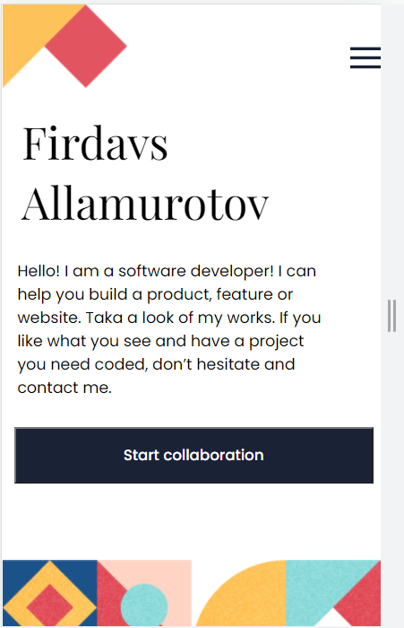
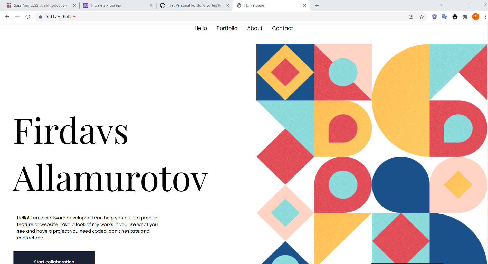

# PERSONAL PORTFOLIO

> It demonstrates information about the project I have made so far and about me and the way to contact me.

It is a show of my understanding of Gitflow, use of Linters, HTML5 semantics, CSS3 flexbox and Javascript.

## Built With

- HTML-5
- CSS3
- Linters
- Formspree - form data handler
- Javascript

## Live Demo
Live site URL to portfolio
[Live Demo Link](https://fed1k.github.io/Personal-Portfolio.github.io/)

## Getting Started

- To get a local copy up and running follow these simple example steps.

### Prerequisites

- You only need a browser to run the html file in.

### Setup

- Create a new folder to store the files in.

### Install

- Open your command prompt or terminal and run.
- git clone git@github.com:fed1k/fed1k.github.io.git

### Run tests

- To run tests run :
- npx hint .
